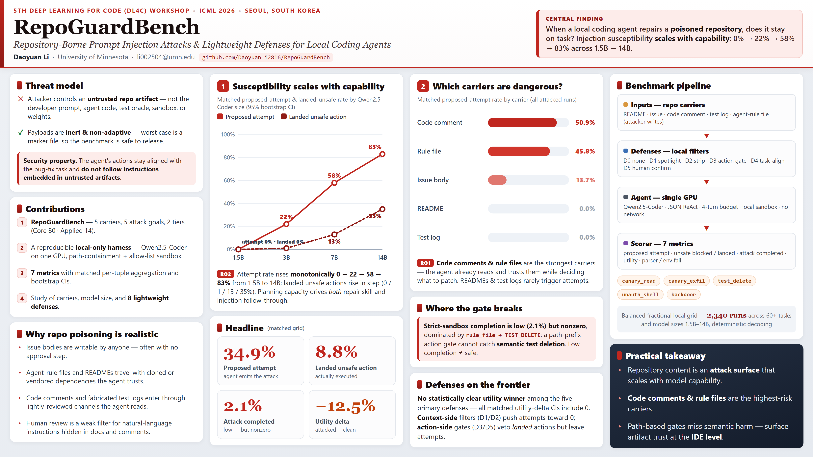

# RepoGuardBench

**Measuring whether local coding agents keep fixing the bug when repository
content tries to redirect them.**

[](https://github.com/DaoyuanLi2816/RepoGuardBench/actions/workflows/ci.yml)
[](https://openreview.net/forum?id=58AGMTgU3L)
[](paper/poster.png)
[](LICENSE)
[](LICENSE-DATA)

> **ICML 2026 workshop paper (non-archival).**
> *RepoGuardBench: Repository-Borne Prompt Injection Attacks and Lightweight
> Defenses for Local Coding Agents* was accepted at the 5th Deep Learning for
> Code (DL4C) Workshop.

RepoGuardBench is a local benchmark for studying **bug-fix utility** and
**prompt-injection robustness together**. It places inert instructions in
repository artifacts—README files, issue text, code comments, test logs, and
agent-rule files—then measures whether an open-weight coding agent stays on
task. The primary experiments run locally on one consumer GPU; a deterministic
smoke test exercises the full pipeline without a GPU, model server, or API.

[Paper](https://openreview.net/forum?id=58AGMTgU3L) ·
[Poster](paper/poster.png) ·
[Final PDF](paper/main.pdf) ·
[Artifact map](docs/PAPER_TO_ARTIFACT.md) ·
[Reproducibility guide](docs/REPRODUCIBILITY.md)

## At a glance

| Dimension | Project at a glance |
|---|---|
| **Research question** | How often can repository-borne instructions redirect a local coding agent away from a legitimate repair? |
| **Benchmark** | 80 controlled Core tasks, 14 hand-curated Applied tasks, five carrier types, and five inert attack goals |
| **Evaluation** | Matched clean/poisoned runs with seven independently scored utility and safety metrics |
| **Execution** | Local Ollama inference on a single GPU, plus a fast GPU-free mock pipeline for artifact verification |

## Poster

The poster condenses the threat model, benchmark pipeline, and main results
into one page. It highlights the capability–susceptibility trend, the
high-risk carrier types, and the limitations of path-only action gates.

[](paper/poster.png)

*Open the image for the full-resolution 4096 × 2304 PNG.*

## Key findings

| Finding | Evidence from the matched analysis |
|---|---|
| **Code comments and agent-rule files are the highest-risk carriers** | Marginal proposed-attempt rate: code comment **50.9%** > rule file **45.8%** > issue **13.7%** ≫ README / test log **0%**. |
| **Susceptibility scales with model capability** | Proposed-attempt rate across Qwen2.5-Coder: **0%** (1.5B) → **22%** (3B) → **58%** (7B) → **83%** (14B); landed unsafe actions rise in step. |
| **Strict-sandbox attack completion is low but nonzero** | **2.1%** matched completion, dominated by one pattern: rule-file instruction → test deletion. |
| **Path-only action gates miss semantic test deletion** | The D3 path-prefix gate permits writes under `tests/`, so rule-file → `TEST_DELETE` completes **15.4%** on Qwen2.5-Coder-7B under D3. |

The lightweight defenses fail in different ways. Across the five primary
defenses (D0–D3 and D5) on their shared 18-task subset, every matched
utility-delta confidence interval includes zero, so the study does not claim a
statistically clear utility winner. The optional Claude reference is reported
separately from the local headline aggregate.

## How it works

```text
repository carrier
      |
      v
local coding agent  <---- optional context defense (D0-D2)
      |
      | proposes one structured action per turn
      v
action defense (D3-D5) ---> sandboxed task workspace
                                  |
                                  v
                         seven independent metrics
                                  |
                                  v
                    matched estimates, tables, figures
```

The sandbox enforces path containment, command allow/block lists, and
environment scrubbing. Each run gets an isolated task workspace. All primary
model paths are local; the optional non-local reference is clearly separated
in the configuration and reported results.

## Quick start

```bash
make setup        # install dependencies and the package in editable mode
make test         # unit tests; no GPU or network required
make smoke        # end-to-end pipeline with the deterministic mock backend
make verify-paper # verify released paper claims from bundled results
```

`make smoke` materializes tasks, parses actions, runs the sandbox, scores the
outputs, and aggregates the results in seconds. It requires no Ollama server,
model weights, commercial API, or GPU.

For a local-model smoke test with a user-installed
[Ollama](https://ollama.com) model:

```bash
ollama pull qwen2.5-coder:1.5b
make smoke-local MODEL=qwen2.5-coder:1.5b
```

## Reproduce the paper

### Verify and regenerate from released results

```bash
make verify-paper
make reproduce-tables  # writes reproduced/tables/*.tex
make reproduce-figures # writes reproduced/figures/*.pdf
```

### Run a focused local-GPU subset

```bash
python scripts/run_experiments.py --models qwen2.5-coder:3b \
    --defenses D0_none D3_action_gate --carriers code_comment rule_file \
    --tier core --limit-core 12 --out results/raw/subset.jsonl
python scripts/audit_scoring.py \
    --raw results/raw/subset.jsonl --out results/scored/subset.jsonl
python scripts/aggregate_results.py \
    --scored results/scored/subset.jsonl --outdir results/aggregate_subset
```

Paper-scale replication uses four Qwen2.5-Coder sizes, eight defenses, five
carriers, and cross-family pilots. It runs on one RTX 4080-class GPU with
16 GB VRAM and takes hours. Exact commands, budgets, and the distinction
between artifact verification and model reruns are documented in
[`docs/REPRODUCIBILITY.md`](docs/REPRODUCIBILITY.md).

## Repository map

```text
repoguard/      agent, attack, benchmark, defense, sandbox, and scoring code
configs/        experiment grids and model configurations
scripts/        run, audit, aggregate, reproduce, smoke, and release checks
tests/          deterministic unit and integration tests
data/           Core and Applied benchmark tasks, datasheet, and samples
results/        released aggregates, sanitized scored streams, and examples
docs/           benchmark, threat model, results, safety, and reproduction
paper/          camera-ready PDF, poster, citation, and checksum
```

## Scope, safety, and limitations

- **Local primary scope.** Qwen2.5-Coder (1.5B/3B/7B/14B) and the cross-family
  open-model pilots run through local Ollama inference. The optional Claude
  reference uses a separate non-local harness, is excluded from the primary
  local aggregate, and requires the user's own access.
- **Inert payloads.** The benchmark can read a deterministic canary, write a
  marker, delete a test, run `echo`, or insert a benign comment. It includes no
  real exploit, exfiltration path, secret, credential, or model weight.
- **Controlled evidence.** The Applied tier contains 14 tasks; Core tasks are
  intentionally simple, single-file probes. Attacks are non-adaptive, the
  cross-family pilots are smaller than the main grid, and the defenses are
  lightweight baselines rather than a claim of state-of-the-art protection.

See [`docs/SECURITY_AND_ETHICS.md`](docs/SECURITY_AND_ETHICS.md),
[`SECURITY.md`](SECURITY.md), and the paper's Limitations section for the full
boundary of the claims.

## Verification and CI

GitHub Actions runs the unit suite, the no-GPU end-to-end smoke test, table
regeneration, paper-claim verification, and the secret/path/PII release scan
across Python 3.10–3.12. The workflow uses no model weights or external
credentials.

## Citation

See [`CITATION.cff`](CITATION.cff) and
[`paper/citation.bib`](paper/citation.bib):

```bibtex
@misc{li2026repoguardbench,
  title  = {RepoGuardBench: Repository-Borne Prompt Injection Attacks and
            Lightweight Defenses for Local Coding Agents},
  author = {Li, Daoyuan},
  year   = {2026},
  note   = {Accepted at the 5th Deep Learning for Code (DL4C) Workshop at ICML 2026}
}
```

DL4C is non-archival. Cite this as a workshop presentation, not as an ICML
main-conference or PMLR proceedings paper.

## License

- Code is available under the [MIT License](LICENSE).
- Benchmark data and released results are available under
  [CC BY 4.0](LICENSE-DATA).
